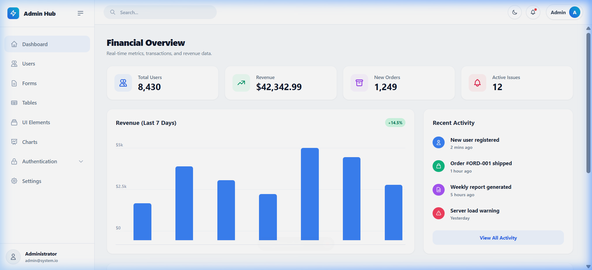

<div align="center">
  <br />
  
  <br />
  <h1>Ultimate Angular 21 Boilerplate 🚀</h1>
  <p><strong>The Most Modern, Production-Ready Angular 21+ Admin Dashboard Starter Kit</strong></p>
  <p>Built with ❤️ using 100% Standalone Components, Signals, Tailwind CSS v3, and the latest Angular control flow.</p>
</div>

---

<div align="center">
  
  <p><i>Premium Dashboard with Financial Overview and Real-time Analytics</i></p>
</div>

---

## Why this Boilerplate? 🤔

Stop wasting time on auth guards, theme toggling, and dashboard layouts. This boilerplate is designed to be **feature-complete**, **performance-optimized**, and **visually stunning** right out of the box.

### Features ✨

*   **⚡ Angular 21 Power**: Harness the full capabilities of the latest Angular release.
*   **🧩 100% Standalone Architecture**: Clean, module-free development scale.
*   **🚦 Signal State Management**: Modern, precise, and reactive component state tracking.
*   **🎨 Premium Tailwind CSS UI**: Hand-crafted layouts with gorgeous dark/light transitions.
*   **📈 Rich Interactive Pages**:
    *   **Analytics Dashboard**: Ready-to-use charts using **ApexCharts**.
    *   **Management Tables**: Signal-based search and filtering for high performance.
    *   **Forms Showcase**: Multi-grid layouts and validation examples.
    *   **Profile Page**: Modern, responsive identity dashboards.
*   **🌗 Smart Theme Manager**: Persistent dark/light mode with anti-flicker (FOUC) script.
*   **🔐 Ready-to-go Auth**: Mock auth service with guards and interceptors already wired up.

---

## Quick Start 🚀

Get the environment up and running in 4 easy steps:

1. **Clone the repository**
   ```bash
   git clone https://github.com/akshhpatil/admin-dashboard.git
   cd admin-dashboard
   ```

2. **Install Dependencies**
   ```bash
   npm install
   ```

3. **Serve Application Locally**
   ```bash
   npm start
   ```

4. **Navigate to `http://localhost:4200`**
   - **User**: `admin`
   - **Password**: `123`

---

## Project Structure 📁

```bash
src/app/
 ├── core/          # Services, interceptors, guards, and base API logic
 ├── features/      # Independent, lazy-loaded page features (Dashboard, Tables, etc.)
 ├── layout/        # Shared app shell (Sidebar, Header, Layout)
 ├── shared/        # Reusable global UI components (Buttons, Modals, Loaders)
 └── assets/        # Global static assets and icons
```

---

## Contributing 🤝

We ❤️ contributions! Whether you're fixing a bug, adding a new UI component, or explaining something better in the docs—your help is welcome.

1. **Fork** the repo.
2. **Read** our [CONTRIBUTING.md](./CONTRIBUTING.md) for coding standards.
3. **Submit** a Pull Request.

**Current Maintainer**: [@akshhpatil](https://github.com/akshhpatil)

---

## License 📜

This project is licensed under the **MIT License** - see the [LICENSE](./LICENSE) file for details.

---

<p align="center">Made with ❤️ for the Angular Community</p>
